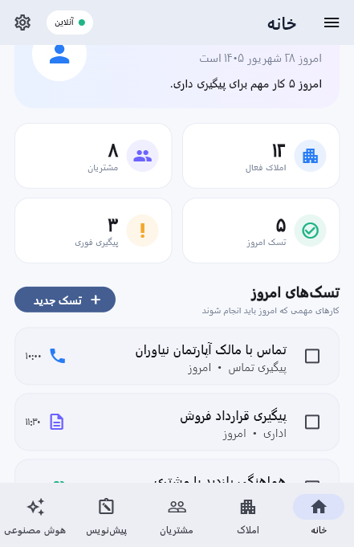
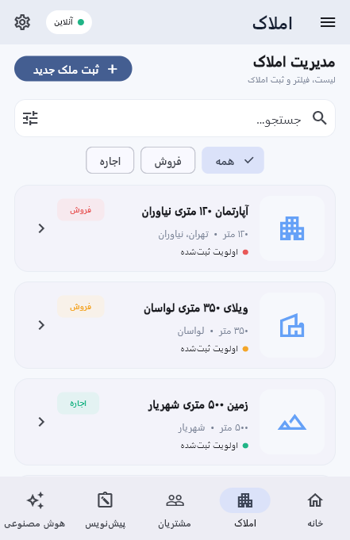
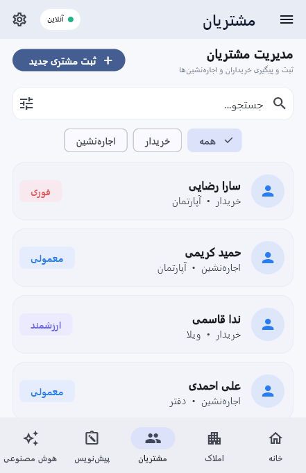
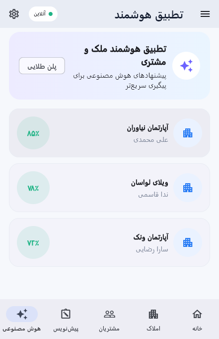
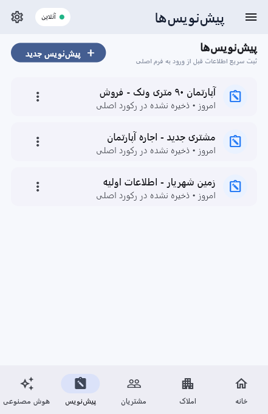
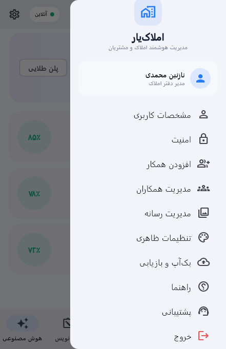
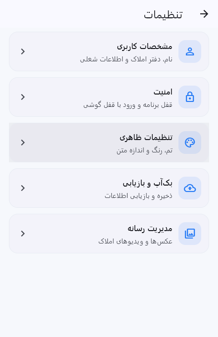

# 🏠 Melkino

A modern Flutter-based **real estate management and CRM application** designed for real estate agents and property offices to manage properties, clients, tasks, drafts, collaborations, and intelligent property-client matching in one unified workspace.

Məlkino provides a clean and responsive management experience with dedicated sections for property management, customer management, daily tasks, quick drafts, smart matching, follow-up workflows, team collaboration, and application settings.

---

## ✨ Features

### 🏠 Property Management

* 🏢 Manage real estate properties
* ➕ Add new properties
* ✏️ Edit property information
* 🔎 Search properties
* 🏷️ Filter properties by contract type
* 💰 Support for sale and rental properties
* 📐 Store property area
* 📍 Store property address
* 🏷️ Property priority indicators
* 🏡 Support for different property types

Supported property types include:

* 🏢 Apartment
* 🏡 Villa
* 🌳 Land
* 🏢 Office
* 🏪 Commercial shop

---

### 👥 Client Management

Manage buyers and tenants from a dedicated customer management section.

* 👤 Add new clients
* ✏️ Manage client information
* 🔎 Search clients
* 🏷️ Filter clients
* 🏠 Define required property type
* 📞 Store client phone number
* ⭐ Set client priority
* 📝 Add client notes
* 🛒 Support for buyers
* 🏘️ Support for tenants

Client priorities include:

* 🚨 Urgent
* ⭐ Valuable
* 🔵 Normal
* ⚪ Low priority

---

### 📊 Dashboard

The main dashboard provides an overview of daily real estate activities.

* 👋 Personalized greeting
* 📈 Active property statistics
* 👥 Client statistics
* ✅ Daily task statistics
* 🚨 Urgent follow-up statistics
* 📋 Today's tasks
* ➕ Create new tasks
* ☑️ Mark tasks as completed

The dashboard provides a quick overview of the most important activities that need attention.

---

### ✅ Task Management

A built-in task management system helps agents organize their daily work.

* ➕ Create tasks
* 📝 Define task titles
* 🏷️ Select task types
* 📅 Set task dates
* 🕐 Set task times
* ☑️ Mark tasks as completed
* 📞 Call follow-up tasks
* 🤝 Meeting tasks
* 🗂️ Administrative tasks
* 📋 General tasks

---

### 📝 Quick Drafts

The drafts section allows agents to quickly save preliminary information before converting it into a structured record.

* 📝 Create quick drafts
* 💾 Save preliminary information
* 🏠 Convert drafts into properties
* 👤 Convert drafts into clients
* 🗑️ Delete drafts
* ⚡ Quickly capture information before completing the main form

Example draft workflow:

```text
📝 Quick Draft
      ↓
📋 Review Information
      ↓
   ┌──┴──┐
   ▼     ▼
🏠 Property  👤 Client
```

---

### 🤖 Smart Property Matching

Melkino includes a dedicated **Smart Matching** section for finding suitable properties for clients.

The matching interface compares property and client requirements and presents matching results.

* 🤖 Smart matching interface
* 👤 Select client requirements
* 🏠 Compare properties
* 📊 Display match percentage
* ✅ Show matching criteria
* ❌ Show mismatched criteria
* 📋 View detailed matching information
* ▶️ Start follow-up workflow

Example matching criteria include:

* 🏢 Property type
* 📍 Location
* 📐 Area
* 💰 Budget
* 🚗 Parking
* ⭐ Priority

---

### 📈 Matching Details

Each matching result can provide a detailed comparison between the property and client requirements.

```text
🏠 Property
      +
👤 Client
      ↓
🤖 Matching Analysis
      ↓
📊 Match Percentage
      ↓
┌───────────────┐
│ ✅ Matching   │
│ ❌ Different  │
└───────────────┘
      ↓
▶️ Start Follow-up
```

The detail screen separates:

* ✅ Matching criteria
* ❌ Different criteria
* 📋 Property information
* 👤 Client requirements

---

### 🔄 Follow-up Workflow

After finding a suitable property-client match, the application provides a structured follow-up workflow.

The workflow contains stages such as:

```text
📞 Contact
   ↓
❤️ Interest
   ↓
🏠 Property Visit
   ↓
🤝 Negotiation
   ↓
🤝 Deal
```

This helps agents keep track of the progress of a potential transaction.

---

### 👥 Collaborator Management

Melkino includes a section for managing real estate office collaborators.

* 👥 View collaborators
* 🔐 Manage access
* ✏️ Change permissions
* 🏠 Property access
* 👤 Client access
* 🚫 Remove collaboration

Available permission examples include:

* 👁️ View properties
* ✏️ Edit properties
* 👁️ View clients
* ✏️ Edit clients

---

### ⚙️ Settings

The application includes a dedicated settings area for managing user and application preferences.

* 👤 User profile
* 🔐 Security settings
* 🎨 Appearance settings
* 🔔 Notifications
* ℹ️ About application
* 🚪 Logout

---

## 🎨 UI & UX

Melkino is designed with a clean modern interface focused on productivity and readability.

* 🎨 Material 3
* 📱 Responsive layouts
* 💻 Desktop-friendly interface
* 📱 Mobile navigation
* 🧭 Side navigation on wider screens
* 🔽 Bottom navigation on smaller screens
* 🧩 Reusable UI components
* 🎯 Consistent color system
* 🃏 Modern cards
* 🔘 Interactive chips and buttons
* 📋 Structured forms
* 📭 Empty and content states
* 🌐 RTL interface support

The application automatically adapts its navigation based on screen width.

```text
📱 Mobile
    ↓
Bottom Navigation

💻 Wide Screen
    ↓
Side Navigation
```

---

## 🛠️ Tech Stack

| Technology           | Usage                                  |
| -------------------- | -------------------------------------- |
| 💙 Flutter           | Cross-platform application development |
| 🎯 Dart              | Programming language                   |
| 🎨 Material 3        | UI and design system                   |
| 🧩 Flutter Widgets   | Reusable interface components          |
| 🧭 Navigator         | Page navigation                        |
| 📱 Responsive Layout | Mobile and desktop layouts             |
| 🌐 RTL               | Persian right-to-left interface        |

---

## 🏗️ Application Architecture

The current MVP uses a lightweight Flutter architecture with reusable components and dedicated pages for each major business area.

```text
lib/
│
├── main.dart
│
├── AppColors
│
├── AppShell
│   ├── Dashboard
│   ├── Properties
│   ├── Clients
│   ├── Drafts
│   └── Smart Matching
│
├── Property Management
│   ├── Property List
│   ├── Property Card
│   └── Property Form
│
├── Client Management
│   ├── Client List
│   ├── Client Card
│   └── Client Form
│
├── Task Management
│   ├── Task List
│   ├── Task Card
│   └── Add Task Dialog
│
├── Draft Management
│   ├── Draft List
│   └── Draft Dialog
│
├── Smart Matching
│   ├── Matching List
│   ├── Matching Details
│   ├── Match Comparison
│   └── Follow-up Workflow
│
├── Collaboration
│   └── Collaborators
│
└── Settings
    ├── Profile
    ├── Security
    ├── Appearance
    ├── Notifications
    └── About
```

---

## 🧩 Main Modules

### 🏠 Dashboard

Provides a centralized overview of properties, clients, tasks, and urgent follow-ups.

### 🏢 Properties

Handles property registration, editing, searching, filtering, and property information.

### 👥 Clients

Manages buyers and tenants together with their requirements and priorities.

### ✅ Tasks

Helps agents organize daily follow-ups, calls, meetings, and administrative tasks.

### 📝 Drafts

Provides a quick way to capture incomplete information before turning it into a property or client record.

### 🤖 Smart Matching

Compares client requirements with available properties and displays matching information.

### 🔄 Workflow

Tracks the progress of a potential transaction from initial contact to deal.

### 👥 Collaborators

Provides basic team and permission management for real estate offices.

### ⚙️ Settings

Contains user profile, security, appearance, notifications, and application information.

---

## 📸 Screenshots

<div align="center">

<table>
<tr>
<td align="center">

<br/>
<b>Homepage</b>
</td>

<td align="center">

<br/>
<b>Properties</b>
</td>

<td align="center">

<br/>
<b>Customers</b>
</td>
</tr>

<tr>
<td align="center">

<br/>
<b>Smart Matching</b>
</td>

<td align="center">

<br/>
<b>Tasks</b>
</td>

<td align="center">

<br/>
<b>Menu</b>
</td>
</tr>

</table>

<br/>


<br/>
<b>Settings</b>

</div>


---

## 🚀 Getting Started

### 1️⃣ Clone the repository

```bash
git clone https://github.com/MobinaFetrati/Melkino.git
```

### 2️⃣ Navigate to the project

```bash
cd Melkino
```

### 3️⃣ Install dependencies

```bash
flutter pub get
```

### 4️⃣ Run the application

```bash
flutter run
```

---

## 📱 Responsive Design

Melkino is designed to work across different screen sizes.

### 📱 Mobile

The application uses a bottom navigation bar for the main sections:

```text
🏠 Home
🏢 Properties
👥 Clients
📝 Drafts
🤖 Matching
```

### 💻 Desktop / Wide Screens

On larger screens, the application switches to a side navigation layout to provide easier access to the main modules.

---

## 🧠 Business Workflow

The application is designed around the daily workflow of a real estate agent:

```text
        🏠 Dashboard
              │
      ┌───────┼────────┐
      ▼       ▼        ▼
   🏢 ملک   👥 مشتری  ✅ تسک
      │       │
      └───┬───┘
          ▼
    🤖 Smart Matching
          │
          ▼
    📊 Match Details
          │
          ▼
    🔄 Follow-up
          │
          ▼
       🤝 Deal
```

---

## 🎯 Project Goals

Melkino was developed to demonstrate practical experience with:

* 💙 Flutter application development
* 🎯 Dart programming
* 🏢 Real estate management concepts
* 👥 CRM-style client management
* 🧠 Matching and recommendation interfaces
* 📊 Dashboard design
* 📝 Task and workflow management
* 📱 Responsive UI development
* 🎨 Material 3
* 🌐 RTL application design
* 🧩 Reusable Flutter widgets
* 🏗️ Scalable application concepts

---

## 🔮 Future Improvements

The current MVP can be extended into a complete real estate management platform with:

* ☁️ Supabase / Firebase backend
* 🗄️ Persistent database
* 🔐 User authentication
* 👥 Role-based access control
* 📍 Map integration
* 📸 Property image management
* 💰 Price and budget management
* 📞 Direct customer communication
* 💬 Internal messaging
* 🔔 Notifications and reminders
* 📊 Advanced analytics
* 📈 Sales and rental reports
* 🤖 Real AI-powered property matching
* 📄 Contract management
* 💳 Payment integration
* ☁️ Cloud synchronization
* 🔄 Multi-office support
* 📱 Dedicated mobile and web experiences

---

## 📌 Project Status

**🚧 MVP / Prototype**

Melkino currently focuses on the **UI, navigation, business workflow concepts, and core real estate management experience**.

The current implementation uses local in-memory sample data, making it suitable for demonstrating the application concept and user experience.

---

## 👩‍💻 Developer

**Mobina Fetrati**

💙 Flutter Developer | Mobile Application Developer

🐙 GitHub:
https://github.com/MobinaFetrati

---

## ⭐ Support

If you find this project interesting, consider giving the repository a ⭐ on GitHub.

```text
🏠 Real Estate
      +
👥 CRM
      +
🤖 Smart Matching
      +
💙 Flutter
      =
✨ Melkino
```

---

## 📄 License

This project is currently developed for **portfolio, educational, and demonstration purposes**.
